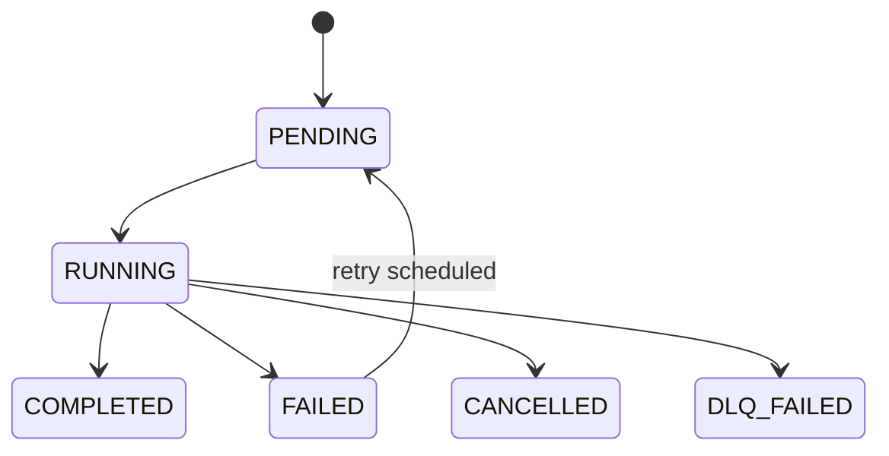

# Queue Entry Schema Specification

This document defines the language-agnostic queue row shape used by liteq's
Postgres-backed protocol after the old `meta` JSONB structure was flattened into
native columns.

## Versioning

- Protocol artifact: `liteq.queue-entry.v1`
- Schema source of truth: `schema/002_create_queue_table.up.sql`
- Release binding: the containing liteq release tag is the authoritative version
  for this document and its companion SQL contracts

The version string above identifies the queue-entry contract. A breaking schema
change must publish a new contract version and corresponding SQL-operation spec.

## Canonical JSON Schema

The protocol row shape is expressed with storage-column names because SQL
clients, ORM models, and migration tooling operate on the persisted schema.

```json
{
  "$schema": "https://json-schema.org/draft/2020-12/schema",
  "$id": "https://liteq.dev/spec/queue-entry.schema.json",
  "title": "liteq QueueEntry",
  "description": "Canonical persisted row shape for liteq queue tables.",
  "type": "object",
  "additionalProperties": false,
  "required": [
    "id",
    "data",
    "status",
    "is_retry",
    "retries",
    "enqueued_at",
    "created_at",
    "updated_at"
  ],
  "properties": {
    "id": {
      "type": "string",
      "minLength": 1,
      "description": "Primary-key identifier for the queue entry."
    },
    "data": {
      "type": "object",
      "default": {},
      "description": "Application payload stored as JSONB."
    },
    "status": {
      "type": "string",
      "enum": ["PENDING", "RUNNING", "FAILED", "COMPLETED", "CANCELLED", "DLQ_FAILED"],
      "default": "PENDING"
    },
    "is_retry": {
      "type": "boolean",
      "default": false
    },
    "retries": {
      "type": "integer",
      "minimum": 0,
      "default": 0
    },
    "retry_policy": {
      "oneOf": [
        { "$ref": "#/$defs/retryPolicy" },
        { "type": "null" }
      ],
      "default": null
    },
    "next_run_at": {
      "oneOf": [
        { "type": "string", "format": "date-time" },
        { "type": "null" }
      ],
      "default": null
    },
    "last_run_at": {
      "oneOf": [
        { "type": "string", "format": "date-time" },
        { "type": "null" }
      ],
      "default": null
    },
    "processed_at": {
      "oneOf": [
        { "type": "string", "format": "date-time" },
        { "type": "null" }
      ],
      "default": null
    },
    "enqueued_at": {
      "type": "string",
      "format": "date-time"
    },
    "dequeued_at": {
      "oneOf": [
        { "type": "string", "format": "date-time" },
        { "type": "null" }
      ],
      "default": null
    },
    "created_at": {
      "type": "string",
      "format": "date-time"
    },
    "updated_at": {
      "type": "string",
      "format": "date-time"
    },
    "deleted_at": {
      "oneOf": [
        { "type": "string", "format": "date-time" },
        { "type": "null" }
      ],
      "default": null
    }
  },
  "$defs": {
    "retryPolicy": {
      "type": "object",
      "additionalProperties": false,
      "required": ["strategy", "maxRetries", "retryDelayMs", "maxDelayMs"],
      "properties": {
        "strategy": {
          "type": "string",
          "enum": ["fixed", "linear", "exponential"]
        },
        "maxRetries": {
          "type": "integer",
          "minimum": 0
        },
        "retryDelayMs": {
          "type": "integer",
          "minimum": 1
        },
        "maxDelayMs": {
          "type": "integer",
          "minimum": 1
        }
      }
    }
  }
}
```

## Reference Entry

The following entry satisfies the schema above.

```json
{
  "id": "task_123",
  "data": {
    "job": "send-email",
    "recipient": "user@example.com"
  },
  "status": "PENDING",
  "is_retry": false,
  "retries": 0,
  "retry_policy": {
    "strategy": "exponential",
    "maxRetries": 3,
    "retryDelayMs": 100,
    "maxDelayMs": 10000
  },
  "next_run_at": null,
  "last_run_at": null,
  "processed_at": null,
  "enqueued_at": "2026-03-31T00:00:00Z",
  "dequeued_at": null,
  "created_at": "2026-03-31T00:00:00Z",
  "updated_at": "2026-03-31T00:00:00Z",
  "deleted_at": null
}
```

## Field Reference

| Field | Postgres type | Default | Nullable | Description |
| --- | --- | --- | --- | --- |
| `id` | `TEXT` | none | No | Primary key for the entry. |
| `data` | `JSONB` | `'{}'::jsonb` | No | Application payload. |
| `status` | `TEXT` | `'PENDING'` | No | Current lifecycle state. |
| `is_retry` | `BOOLEAN` | `false` | No | Indicates whether the row is a retry attempt. |
| `retries` | `INTEGER` | `0` | No | Number of retry attempts already scheduled. |
| `retry_policy` | `JSONB` | `NULL` | Yes | Optional retry settings applied to the entry. |
| `next_run_at` | `TIMESTAMPTZ` | `NULL` | Yes | Earliest time a retry entry becomes dequeuable. |
| `last_run_at` | `TIMESTAMPTZ` | `NULL` | Yes | Last observed execution timestamp. |
| `processed_at` | `TIMESTAMPTZ` | `NULL` | Yes | Completion/failure timestamp. |
| `enqueued_at` | `TIMESTAMPTZ` | `NOW()` | No | Time the row entered the queue. |
| `dequeued_at` | `TIMESTAMPTZ` | `NULL` | Yes | Time the worker claimed the row. |
| `created_at` | `TIMESTAMPTZ` | `NOW()` | No | Row creation timestamp. |
| `updated_at` | `TIMESTAMPTZ` | `NOW()` | No | Last modification timestamp. |
| `deleted_at` | `TIMESTAMPTZ` | `NULL` | Yes | Soft-delete marker. |

## Status Lifecycle

Valid task-status transitions are:



Operational notes:

- `PENDING` rows are eligible for dequeue when `deleted_at IS NULL` and, for
  retries, `next_run_at <= NOW()`.
- `RUNNING` is set atomically by the dequeue claim query.
- `FAILED` records a failed processing attempt. The current worker may then
  enqueue a new retry row or push the task to the DLQ.
- `DLQ_FAILED` is a terminal recovery state used when DLQ enqueue retries are
  exhausted.

## Retry Policy Sub-Schema

`retry_policy` is stored as JSONB and matches the Go `RetryPolicy` type:

| Field | Type | Constraints | Description |
| --- | --- | --- | --- |
| `strategy` | `string` | `fixed`, `linear`, `exponential` | Backoff algorithm. Empty values normalize to `exponential` in Go. |
| `maxRetries` | `integer` | `>= 0` | Maximum allowed retries. |
| `retryDelayMs` | `integer` | `> 0` | Base delay in milliseconds. |
| `maxDelayMs` | `integer` | `> 0` | Maximum delay cap in milliseconds. |

## Go Compatibility Notes

- `BaseQueueEntry` models the same persisted fields in Go.
- SQL column names remain the protocol source of truth.
- Some Go JSON tags use camelCase while audit timestamps use snake_case; client
  libraries should normalize names deliberately rather than infer them.
