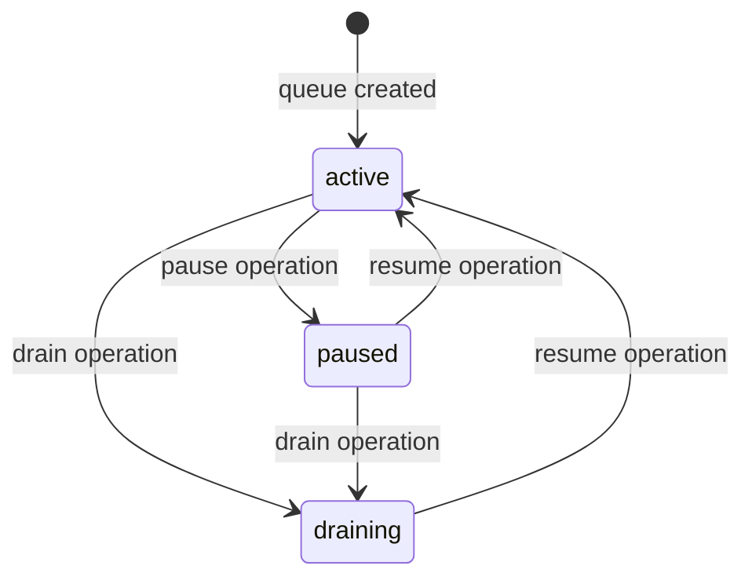

# Queue Lifecycle & Observability

This document defines queue-level operational concepts including lifecycle hooks,
queue states, and observability patterns for the liteq Postgres-backed task queue.

## Versioning

- Protocol artifact: `liteq.queue-lifecycle.v1`
- Schema source: `schema/000_create_schema.v1.up.sql` (queue_meta, queue_states)
- Release binding: the containing liteq release tag is the authoritative version

## Queue States

A queue can be in one of three operational states, tracked in the `queue_meta` table:

| State | Description | Behavior |
|-------|-------------|----------|
| `active` | Normal operation | Queue accepts new tasks and workers can dequeue |
| `paused` | Temporarily suspended | Queue accepts new tasks but workers skip dequeue |
| `draining` | Emptying and suspended | Queue is paused and all existing tasks are soft-deleted |

### State Transitions



### Queue State Schema

**queue_meta table** - Stores queue-level configuration and operational state:

```sql
CREATE TABLE {schema}.queue_meta (
    queue_name TEXT PRIMARY KEY,
    retry_policy JSONB NOT NULL DEFAULT '{}'::jsonb,
    state TEXT NOT NULL DEFAULT 'active' 
        CHECK (state IN ('active', 'paused', 'draining')),
    created_at TIMESTAMPTZ NOT NULL DEFAULT NOW(),
    updated_at TIMESTAMPTZ NOT NULL DEFAULT NOW()
);
```

**queue_states table** - Audit log for state transitions:

```sql
CREATE TABLE {schema}.queue_states (
    id BIGINT GENERATED ALWAYS AS IDENTITY PRIMARY KEY,
    queue_name TEXT NOT NULL,
    state TEXT NOT NULL CHECK (state IN ('active', 'paused', 'draining')),
    changed_at TIMESTAMPTZ NOT NULL DEFAULT NOW(),
    reason TEXT
);
```

## Lifecycle Hooks

The Go implementation provides a `Hooks` interface for observing task and queue 
lifecycle events. Clients can implement custom hooks for logging, metrics, or tracing.

All hooks receive a `context.Context` as their first parameter and are called 
synchronously within the worker's execution flow. Hooks are wrapped with panic 
recovery to prevent a misbehaving hook from crashing the worker.

### Task Lifecycle Hooks

Task-level hooks track the progression of individual queue entries through their
processing lifecycle:

| Hook | Trigger | Parameters | Typical Use |
|------|---------|------------|-------------|
| `OnEnqueue` | Task inserted into queue | `ctx`, `queueName`, `entryID` | Log enqueue, emit metrics counter |
| `OnDequeue` | Batch claimed from queue | `ctx`, `queueName`, `count` | Log batch size, track claim rate |
| `OnTaskStart` | Worker begins processing task | `ctx`, `taskID` | Start timer, emit processing event |
| `OnTaskComplete` | Task completes successfully | `ctx`, `taskID`, `duration` | Log success, record latency metric |
| `OnRetry` | Task scheduled for retry | `ctx`, `taskID`, `attempt`, `nextRunAt` | Log retry, track retry rate by attempt |
| `OnDLQ` | Task sent to dead-letter queue | `ctx`, `taskID`, `reason` | Alert on DLQ, log reason |
| `OnDLQFailed` | DLQ enqueue failed | `ctx`, `taskID`, `err` | Critical alert, task lost |

### Queue State Lifecycle Hooks

Queue-level hooks track operational state changes:

| Hook | Trigger | Parameters | Typical Use |
|------|---------|------------|-------------|
| `OnQueuePaused` | Queue paused via API | `ctx`, `queueName` | Log pause event, update dashboard |
| `OnQueueResumed` | Queue resumed via API | `ctx`, `queueName` | Log resume event, update dashboard |
| `OnQueueDrained` | Queue drained (deleted + paused) | `ctx`, `queueName` | Alert on drain, audit log |

### Hook Interface (Go)

```go
type Hooks interface {
    OnEnqueue(ctx context.Context, queueName, entryID string)
    OnDequeue(ctx context.Context, queueName string, count int)
    OnTaskStart(ctx context.Context, taskID string)
    OnTaskComplete(ctx context.Context, taskID string, duration time.Duration)
    OnRetry(ctx context.Context, taskID string, attempt int, nextRunAt time.Time)
    OnDLQ(ctx context.Context, taskID, reason string)
    OnDLQFailed(ctx context.Context, taskID string, err error)
    OnQueuePaused(ctx context.Context, queueName string)
    OnQueueResumed(ctx context.Context, queueName string)
    OnQueueDrained(ctx context.Context, queueName string)
}
```

### Built-in Hook Implementations

**BaseHooks** - No-op implementation for selective overriding:

```go
type BaseHooks struct{}

// Embed BaseHooks in your struct to override only specific hooks
type MyHooks struct {
    liteq.BaseHooks
    logger *slog.Logger
}

func (h MyHooks) OnTaskComplete(ctx context.Context, taskID string, duration time.Duration) {
    h.logger.InfoContext(ctx, "task done", "id", taskID, "duration", duration)
}
```

**SlogHooks** - Structured logging via Go's `log/slog`:

```go
hooks := liteq.SlogHooks{
    Logger: slog.Default(),
}

worker := liteq.NewWorker(queue, consumer, liteq.WorkerConfig{
    Hooks: hooks,
})
```

### Implementation Notes

- Hooks are **synchronous** - they execute inline with worker operations
- Hooks are **panic-safe** - panics are recovered to prevent worker crashes
- Hook execution time adds to processing latency - keep hooks fast
- For expensive operations (external API calls, DB writes), use buffered async dispatch
- Hooks receive **context** - propagate distributed tracing, cancellation signals

### Cross-Language Considerations

While the `Hooks` interface is Go-specific, other language clients should provide
equivalent observability patterns:

- **TypeScript/Node.js** - EventEmitter pattern or callback registry
- **Python** - Signals/hooks pattern or observer protocol
- **Ruby** - ActiveSupport::Notifications or custom callbacks
- **Java** - Listener interfaces or reactive streams

Key principles for cross-language implementations:

1. Provide opt-in observability (no forced dependencies)
2. Fail gracefully (don't crash on hook errors)
3. Document performance implications
4. Support structured context (correlation IDs, trace context)

## Queue State Operations

Queue state operations are documented in [`sql-operations.md`](./sql-operations.md)
section 9. These operations interact with the `queue_meta` and `queue_states` tables:

- `pause_queue` - Set queue state to `paused` and audit the change
- `resume_queue` - Set queue state to `active` and audit the change
- `is_paused` - Check current queue state
- `drain_queue` - Soft-delete all entries and set state to `draining`

See [`sql-operations.md`](./sql-operations.md) for full SQL contracts.

## Worker Behavior by Queue State

The Go `Worker` polls the queue at a configured interval and checks queue state
before dequeue:

| Queue State | Worker Behavior |
|-------------|-----------------|
| `active` | Normal dequeue and processing |
| `paused` | Skip dequeue silently, log via `OnQueuePaused` (first occurrence) |
| `draining` | Skip dequeue silently, treat as paused |

When a paused/draining queue is encountered:

1. Worker checks `IsPaused()` before each dequeue
2. If paused, worker sleeps for poll interval and retries
3. Hook `OnQueuePaused` is called once per pause detection
4. No error is returned - worker continues polling
5. When queue is resumed, processing resumes automatically

**Error Handling:**

- `Dequeue()` returns `ErrQueuePaused` if queue state is `paused` or `draining`
- Worker logs the pause but does not treat it as a fatal error
- Tasks failing during processing may still be retried or sent to DLQ
- DLQ operations are **not blocked** by queue pause state

## Observability Best Practices

### Metrics to Track

**Task-level metrics:**
- Enqueue rate (tasks/sec)
- Dequeue batch sizes
- Processing latency (p50, p95, p99)
- Success rate vs failure rate
- Retry attempts distribution
- DLQ rate (alerts if > threshold)
- DLQ failure rate (critical alerts)

**Queue-level metrics:**
- Queue depth (pending tasks count)
- Queue state (active/paused/draining)
- State transition frequency
- Worker poll cycles
- Pause duration

### Structured Logging

Use structured fields for filtering and correlation:

```json
{
  "event": "task_completed",
  "queue": "email-notifications",
  "task_id": "task_123",
  "duration_ms": 250,
  "retry_attempt": 0,
  "trace_id": "abc123"
}
```

### Alerting Recommendations

**Critical alerts:**
- `OnDLQFailed` - Task cannot be saved to DLQ, data loss risk
- DLQ rate > 5% of total tasks
- Queue depth growing unbounded

**Warning alerts:**
- `OnDLQ` - Task sent to DLQ (investigate pattern)
- Queue paused for > N minutes
- Processing latency p95 > SLA threshold

**Info-level:**
- Queue state changes (pause/resume/drain)
- Retry scheduling (normal operation)
- Batch sizes trending up/down
